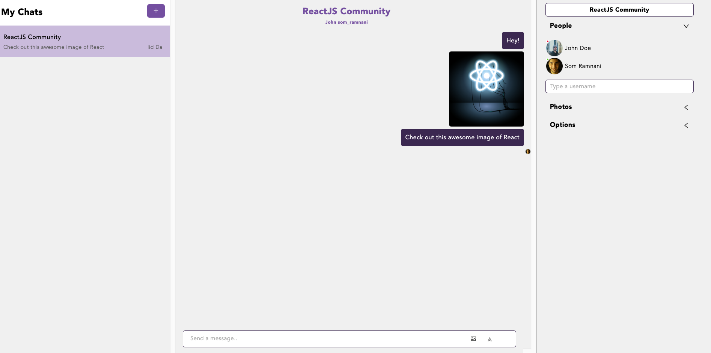

# Messenger App

A React application that uses the Chat Engine REST API 

## :clipboard: Table of contents

- [ &#128161; Purpose](#-purpose)
- [&#x1f527; Technologies & Tools](#-technology--tools)
- [&#x1f4f2; Features](#-features) 
- [:framed_picture: Images](#framed_picture-images)

## &#128161; Purpose
A Slack clone that allows users to commuicate with each other

## &#x1f527; Key Technology & Tools

- HTML5
- CSS3
- JavaScript
  - React
- API's:
  - Chat Engine
  
##  &#x1f4f2; Features
- Users can send messages & images

## :framed_picture: Images

